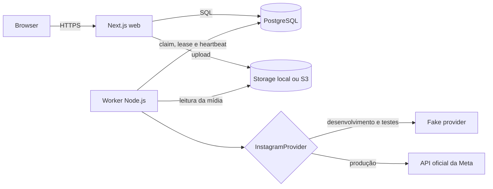

# Arquitetura

## Visão geral

O Instagestor é um monólito modular com dois processos implantáveis. O processo web atende o painel e as rotas HTTP; o worker consome jobs. Ambos usam o mesmo código de domínio e o mesmo PostgreSQL.

## Responsabilidades

### Web

- autentica o único administrador da organização;
- conecta e organiza contas e grupos;
- valida e armazena uploads;
- cria campanhas, congela o snapshot de destinos e materializa os jobs;
- expõe histórico, fila e healthcheck sanitizado;
- recebe OAuth e callbacks assinados da Meta.

O web não executa publicação em segundo plano. Isso evita que reinícios e escalonamento do servidor HTTP afetem o processamento da fila.

### PostgreSQL

É a fonte de verdade para usuários, contas, tokens criptografados, mídias, campanhas, jobs, auditoria e heartbeat. Também implementa a fila com transações, `FOR UPDATE SKIP LOCKED`, leases e fencing tokens. A restrição única `(campaign_id, instagram_account_id)` impede criar dois jobs para o mesmo destino de uma campanha.

Os destinos de `campaign_targets` são um snapshot. Alterar um grupo depois do agendamento não muda uma campanha já confirmada.

### Worker

Faz polling do PostgreSQL, reivindica no máximo um job por runner, valida ownership em cada escrita e conversa com storage e provider. O mesmo processo mantém heartbeat, recupera leases vencidos e atualiza tokens próximos da expiração. `WORKER_CONCURRENCY` controla quantos runners existem por processo.

### Storage

A interface mínima possui implementações local e S3 compatível. MinIO fornece S3 no Compose; R2, AWS S3 ou outro endpoint compatível podem ser usados em produção. O browser visualiza ambos por uma URL assinada de mesma origem, servida em streaming pelo web; assim o bucket continua privado e a CSP não precisa liberar um endpoint MinIO/S3. A Meta recebe uma URL temporária diretamente acessível: no storage S3 ela é assinada contra `S3_PUBLIC_ENDPOINT`, enquanto o storage local usa a mesma rota assinada do web. `S3_ENDPOINT` pode apontar para a rede interna usada nas operações do app.

### Instagram provider

Há duas implementações porque ambas são usadas: fake, para desenvolvimento determinístico, e Meta, para produção. A seleção é explícita por `INSTAGRAM_PROVIDER`; o processo falha ao tentar usar fake em produção sem o override intencional.

## Fluxos principais

### Agendamento

1. O administrador cria campanha e associa mídia pronta.
2. O servidor resolve contas ou grupos e valida as contas conectadas.
3. Uma transação bloqueia a campanha, grava o snapshot ordenado e cria um job por conta.
4. Horários são gravados em UTC, preservando o timezone informado para apresentação.
5. A unicidade no banco protege contra confirmação duplicada.

### Publicação

1. O worker seleciona um job vencido elegível com `SKIP LOCKED`.
2. Grava lease, owner e incrementa o fencing token.
3. Obtém URL temporária da mídia e cria o container da Meta.
4. Aguarda o container sem ocupar continuamente um runner.
5. Consulta quota, publica e persiste o ID retornado.
6. Falhas classificadas como transitórias recebem backoff; resultado ambíguo nunca é repetido automaticamente.

Detalhes e estados estão em [QUEUE.md](QUEUE.md).

## Concorrência e escala

- Vários workers podem compartilhar o banco: `SKIP LOCKED` impede claim simultâneo.
- Toda atualização sensível exige `locked_by` e o fencing token vigente; um worker antigo perde o direito de escrever.
- Advisory locks limitam simultaneamente chamadas globais e por conta sem infraestrutura adicional.
- O web pode ter várias réplicas porque sessão, rate limit e estado de domínio não dependem da memória de uma instância.
- A escala inicial esperada cabe em polling do painel e do worker. Redis, broker, WebSocket, Kubernetes e event bus não fazem parte da arquitetura.

## Saúde e observabilidade

`GET /api/health` verifica aplicação e conectividade com o PostgreSQL sem devolver configuração sensível. Cada worker atualiza `worker_heartbeats` a cada dez segundos; o healthcheck da imagem exige um heartbeat do próprio hostname nos últimos trinta segundos. Logs são JSON e chaves com nomes sensíveis são redigidas.

O healthcheck não substitui alertas externos em produção. Monitore ao menos indisponibilidade HTTP, heartbeat antigo, crescimento de `RETRY_WAIT`, jobs `FAILED` e qualquer `RECONCILIATION_REQUIRED`.

## Decisões de simplificação (Ponytail FULL)

- PostgreSQL substitui Redis e um broker dedicado sem remover locking, recovery ou idempotência.
- Web e worker compartilham módulos; não existem microserviços nem RPC interno.
- Funções e módulos pequenos são preferidos a repositories, factories e classes genéricas.
- Polling é suficiente para a escala prevista; não há WebSocket.
- MinIO é somente a implementação local do contrato S3, não um requisito de produção.
- Fencing, criptografia de tokens, auditoria, retries e reconciliação ambígua permanecem porque são garantias, não complexidade acidental.
