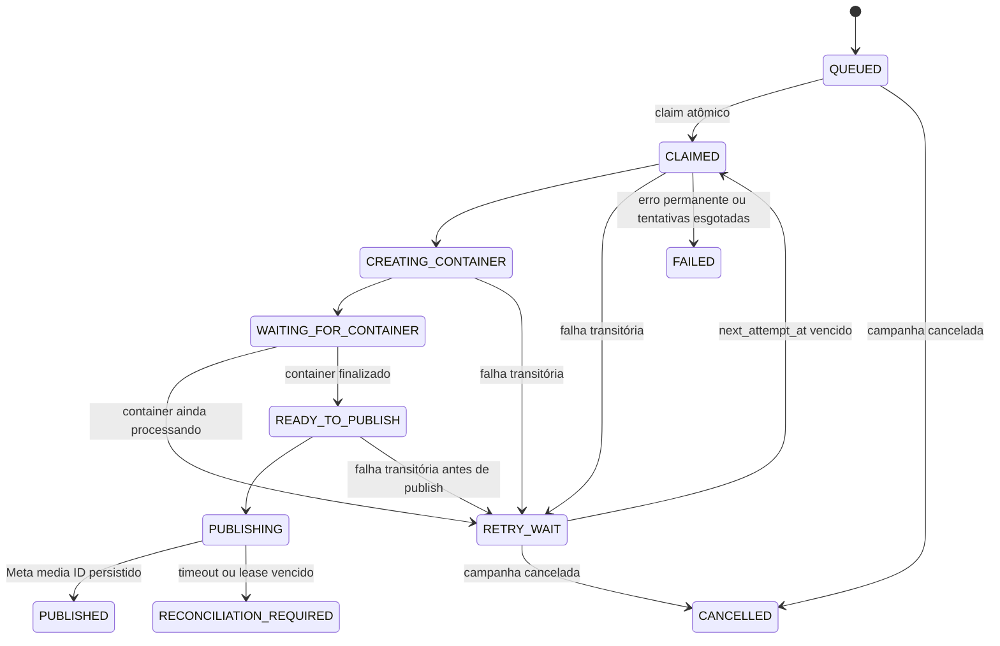

# Fila, retries e recuperação

## Fonte de verdade

`publication_jobs` no PostgreSQL é a fila. Não há estado confiável somente em memória e não há broker externo. Cada job pertence a uma campanha e a uma conta; a restrição única por campanha/conta é a primeira barreira contra duplicação.

## Estados

## Claim atômico

O worker procura apenas jobs cujo horário chegou, cuja campanha está ativa e cuja conta pode publicar. A seleção ordenada usa `FOR UPDATE OF jobs SKIP LOCKED LIMIT 1`; o mesmo statement atualiza o job para `CLAIMED`, define `locked_by`, cria `lock_expires_at` e incrementa `fencing_token`.

Consequências:

- dois workers não recebem o mesmo job simultaneamente;
- um worker lento não bloqueia a seleção de outros jobs;
- não existe janela entre “selecionar” e “marcar como claimed”.

## Lease e fencing

O lease dura `JOB_LOCK_SECONDS` (180 segundos por padrão) e o worker o renova a cada, no máximo, um terço desse período enquanto mantém `id`, `locked_by` e `fencing_token`. Escritas do processamento conferem os três valores. Se a renovação falhar até o prazo, ou outro worker recuperar o job, o token aumenta e qualquer escrita do owner antigo afeta zero linhas; o processamento encerra com `LostLeaseError`.

O fencing token deve ser mantido mesmo que o polling ou o recovery sejam refatorados. Ele impede que um processo pausado volte depois do vencimento do lease e sobrescreva o resultado mais novo.

## Recuperação de crash

Na inicialização e a cada trinta segundos, o worker procura locks expirados:

- `CLAIMED`, `CREATING_CONTAINER`, `WAITING_FOR_CONTAINER` e `READY_TO_PUBLISH` voltam para `RETRY_WAIT` com execução imediata;
- `PUBLISHING` vira `RECONCILIATION_REQUIRED`, pois a Meta pode ter aceitado a publicação antes da conexão cair;
- em ambos os casos owner e lease são limpos e o fencing token avança.

Nenhum job desaparece quando um processo morre. O processo recebe `SIGTERM`/`SIGINT`, deixa de reivindicar novos jobs, conclui os runners atuais, remove seu heartbeat e fecha o banco.

## Retries

Erros são classificados em `AUTH`, `RATE_LIMIT`, `VALIDATION`, `TRANSIENT`, `PERMANENT` ou `AMBIGUOUS`.

- transitórios e rate limit: `RETRY_WAIT`;
- autenticação, validação ou permanente: `FAILED`;
- tentativas esgotadas: `FAILED`;
- ambíguo durante `media_publish`: `RECONCILIATION_REQUIRED`.

O backoff usa equal jitter, cresce exponencialmente e é limitado a uma hora. Quando a Meta fornece `Retry-After`, ele é o piso da espera e recebe uma pequena dispersão positiva, sem ultrapassar o mesmo teto. A espera do processamento do container não incrementa `attempt_count`.

`MAX_PUBLICATION_ATTEMPTS` define o limite gravado em cada novo job e vale 5 por padrão. O valor fica congelado no job para que mudar a configuração não altere retroativamente campanhas já materializadas.

O polling de um container não pode durar indefinidamente: após uma hora desde a primeira criação e persistência do container, registrada em `container_started_at`, o job falha com `CONTAINER_PROCESSING_TIMEOUT`. Esperas anteriores por quota ou concorrência não consomem esse prazo. Um retry manual limpa os IDs do container e os timestamps de execução, iniciando uma tentativa nova e deliberada.

## Proteção contra publicação duplicada

O ID do container é persistido e reutilizado nas retomadas anteriores ao publish. Depois que a chamada `media_publish` começa, timeout ou perda de lease são tratados como resultado desconhecido. O sistema não chama `media_publish` uma segunda vez automaticamente e exige reconciliação humana.

Não transforme `RECONCILIATION_REQUIRED` em retry automático. A ausência de resposta HTTP não prova que a Meta rejeitou a operação.

O retry manual só aceita `FAILED`; ele não aceita um job ambíguo. Duplicar a campanha é uma ação separada e explícita.

## Pausa e cancelamento

O claim consulta o estado da campanha. Uma campanha pausada deixa jobs futuros intactos, mas inelegíveis; ao retomar, jobs atrasados tornam-se elegíveis imediatamente. Cancelamento muda apenas `QUEUED` e `RETRY_WAIT` para `CANCELLED`; um job já em uma chamada externa não pode ser “despublicado” de forma segura.

## Limites de concorrência

Além de `WORKER_CONCURRENCY`, advisory locks do PostgreSQL implementam:

- `META_GLOBAL_CONCURRENCY`: máximo de chamadas de publicação concorrentes no conjunto de workers;
- `META_ACCOUNT_CONCURRENCY`: máximo para uma única conta.

Se não houver slot, o job é liberado para uma espera curta sem consumir tentativa.

## Operação

Sinais importantes no painel e nos logs:

- heartbeat mais antigo que 30 segundos: worker indisponível ou sem banco;
- muitos `QUEUED` vencidos: capacidade insuficiente, campanha pausada ou conta indisponível;
- aumento de `RETRY_WAIT`: falha externa ou rate limit;
- `FAILED`: requer correção da causa e retry manual;
- `RECONCILIATION_REQUIRED`: confirme o resultado no Instagram antes de qualquer nova publicação.

Não altere estados diretamente no banco durante operação normal. As ações do painel preservam invariantes e registram auditoria.
